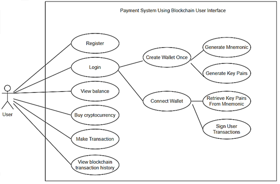
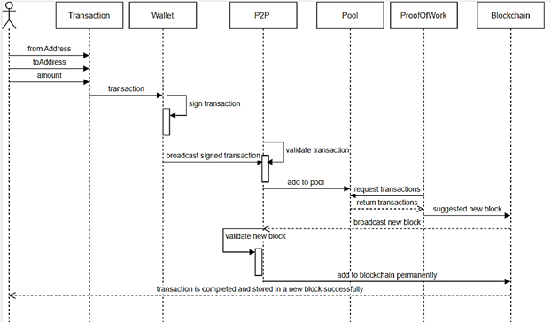
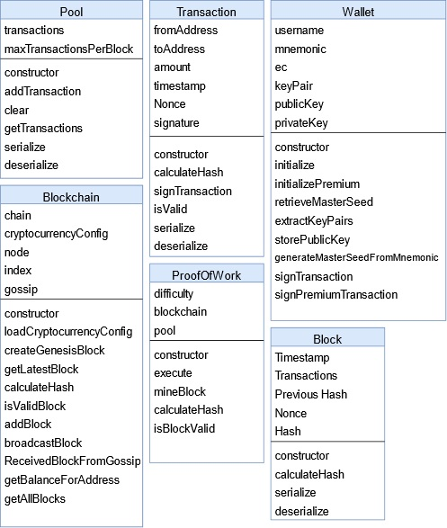
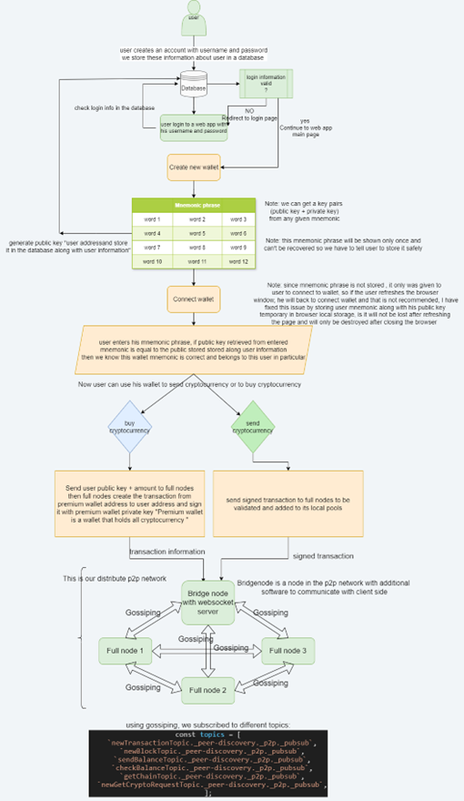

# Payment System Using Blockchain Technology

**This is my Master Thesis project, built entirely from scratch with a custom Peer-to-Peer network, a custom wallet, and a custom "SDC" cryptocurrency. The development of this blockchain took around 15 months in total.**

## Technologies Used

1. **Wallet:** BIP39, SHA256, Elliptic Curve Cryptography, and Elliptic Curve Digital Signature Algorithm.
2. **Consensus Mechanism:** Non-incentivized Proof of Work.
3. **Peer-to-Peer Network:** Pure unstructured Peer-to-Peer network.
4. **Communication Between Nodes:** Topic-based publish/subscribe.
5. **Peer Discovery Mechanism:** Multicast DNS.
6. **User Interface:** HTML and SCSS.
7. **Database Communication:** PHP.
8. **Main Programming Language:** JavaScript.

### Note:
 there is a video demo for the blockchain available on youtube `https://www.youtube.com/watch?v=8FD0U1Xxr-c`

## Running the Blockchain on Your Computer

### Prerequisites

- Node.js and npm installed
- XAMPP server installed (place the entire project folder inside the `htdocs` folder in XAMPP)

### Database Setup

1. Create a new database named `paymentdb` in XAMPP `localhost/phpmyadmin` with the appropriate collation type.
2. Import the `paymentdb.sql` file provided within the project files.
3. Clone the repository using `gh repo clone KinanSliman/payment-system-using-blockchain` to a new folder.
4. Move the folder to the `htdocs` folder inside the `xampp` folder.

## Running the Blockchain Network

### Starting Full Nodes

1. Open a terminal in the project's root directory.
2. Run the command: `node fullnodes.mjs`

**Note:** To adjust the number of starting nodes, modify **line 92** in `fullnodes.mjs` (consult the code for details).

**Note:** Use a small number of nodes since they will all be running on your computer.

### Starting Bridge Node

**Note:** This is the method to communicate between the web app and the blockchain.

1. Open a second terminal in the project's root directory.
2. Run the command: `node bridgenode.mjs`

Now the blockchain is ready to provide its services to users.

## Running the Web App

1. Open a browser and navigate to `http://localhost/payment-system-using-blockchain`.
2. Register a new user account by entering a username and password.
3. Create a new wallet.
4. Connect to your wallet.

Great! You have successfully run the blockchain on your computer and you can now buy `SDC` cryptocurrency from the premium wallet. You are also able to send/receive transactions to/from other wallets.

## How It Works

### User Use Cases Diagram

### Sequence Diagram

### Classes Diagram

### General Dataflow Chart

